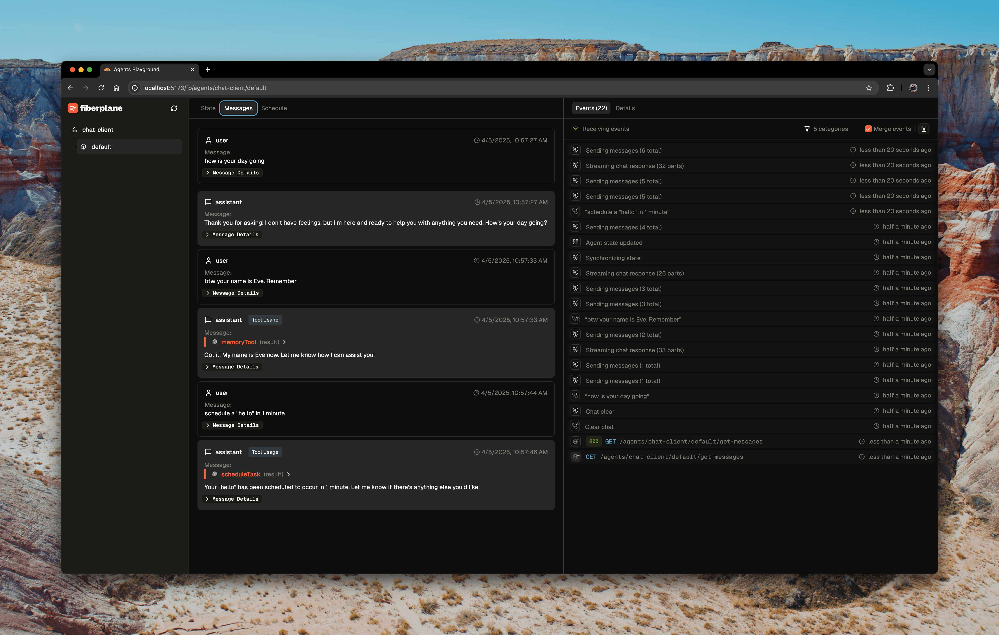
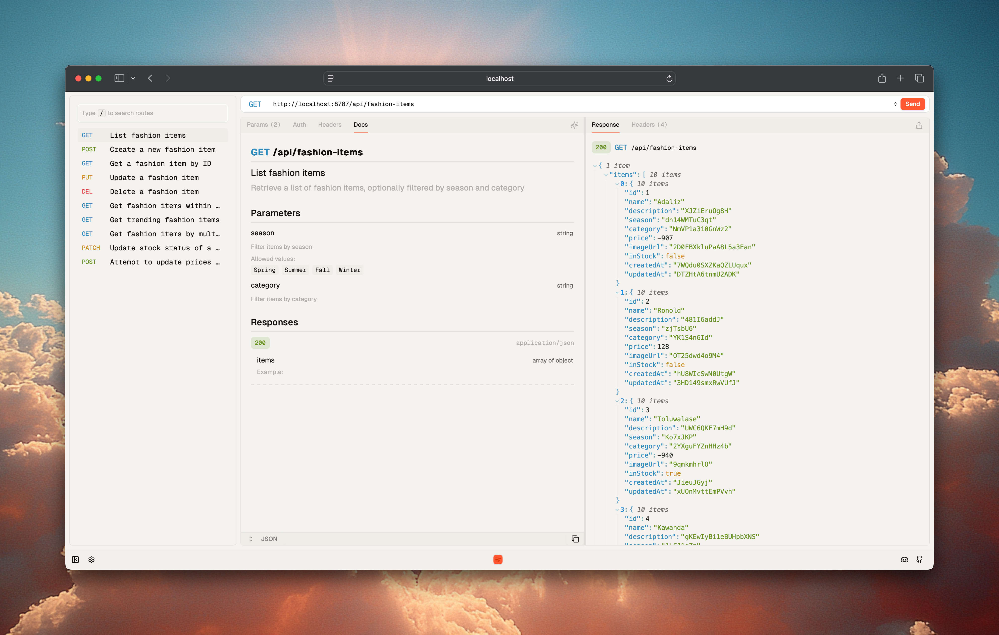

# Home of the playgrounds

In this repository you can find two packages:

* `@fiberplane/agents`
  A toolkit for introspecting and debugging agents built with Cloudflare's Agents SDK. For more information see [ packages/agents](./packages/agents/)

* `@fiberplane/hono`
  Fiberplane is an embeddable API playground for Hono apis. Install `@fiberplane/hono`, point its middleware to your OpenAPI spec, and you're off to the races. For more information see [packages/hono](./packages//hono/)

